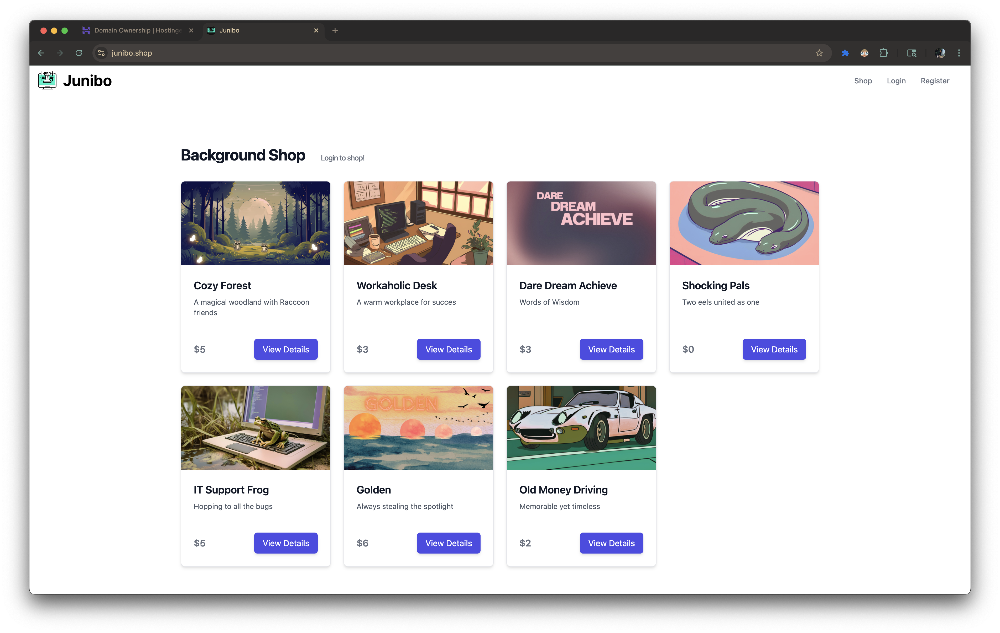
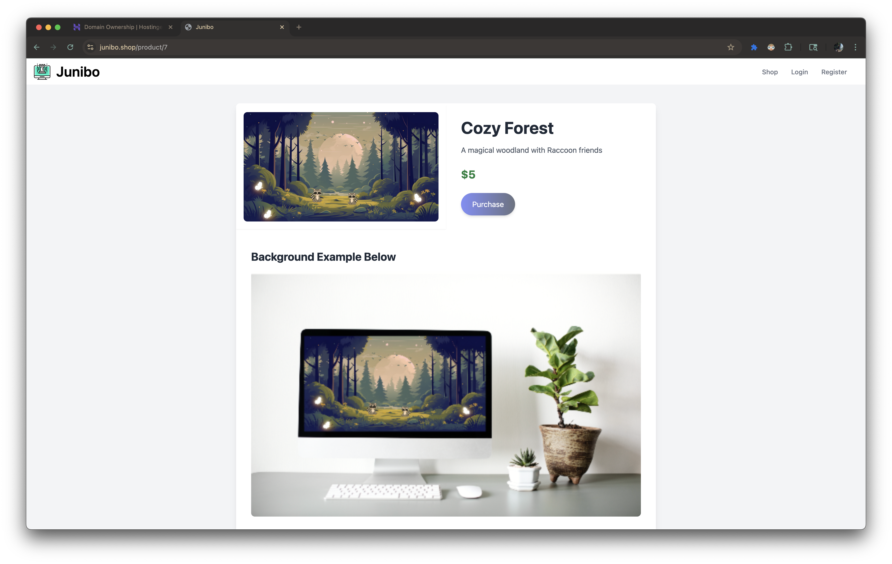
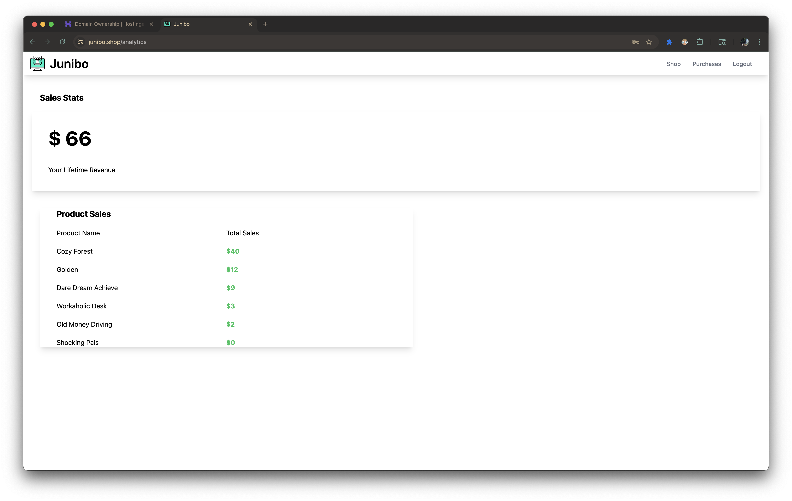

# 🛍️ Junibo – Micro E-commerce Platform

Junibo is a minimalist micro e-commerce wallpaper platform built with **Django** and styled with **Tailwind CSS**. It focuses on simplicity, modern UI, and extendability – perfect for small shops or as a foundation for full-scale e-commerce solutions.

---

## ✨ Features

- 🛒 Product browsing with responsive design
- 💳 Stripe checkout system
- 🧾 Email Reciepts/Purchase Log
- 📦 Admin dashboard 
- 🌙 Tailwind-powered theme

---

## 🖼️ Screenshots

### 💻 Desktop Homepage

### 🧺 View Page

### 💳 Admin Page

---

## 🧑‍💻 Tech Stack

- **Backend**: Django 4.x, Stripe API
- **Frontend**: Tailwind CSS
- **Database**: SQLite (dev) / PostgreSQL (prod)
- **Deployment**: Docker + Gunicorn + Nginx

---
This project was deployed on a kvm vps but recently took it down as for
I have improved e-commerce projects that I am now more involved with. 
Regardless this was a fun little store to build and learned much doing so.
